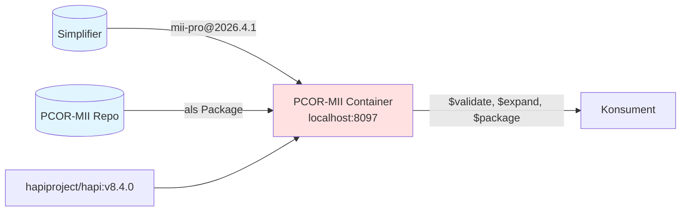
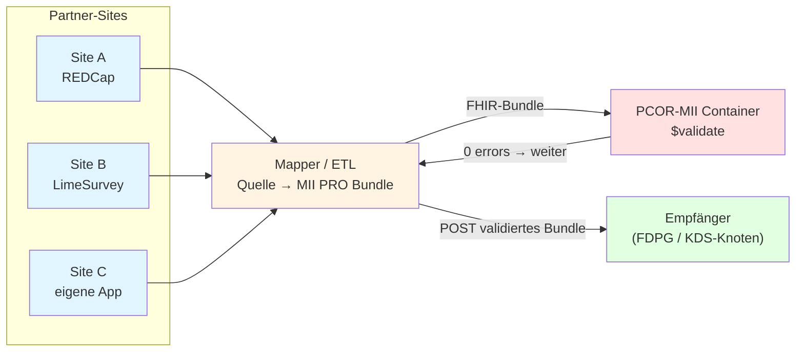

Diese Seite beschreibt, wie ein FHIR-Server für PCOR-MII bestückt wird und wie der Datenfluss im Pilot aussieht.

## Container-Stack

Im Verzeichnis `docker/` liegt eine Dockerfile, die HAPI FHIR mit MII PRO + PCOR-MII vorinstalliert baut. Bake-Time, kein Cold-Start.



`docker compose up --build` reicht. Vorhandene Endpoints: Standard-HAPI plus `$validate` für eingehende QRs.

## Bestückung eines anderen Empfänger-Servers

Eine `QuestionnaireResponse` ist ohne den referenzierten Questionnaire, dessen ValueSets/CodeSystems und das PRO-QR-Profil **nicht** interpretierbar. Zwei pragmatische Wege:

**Transaction-Bundle**: alle nötigen Resources (Questionnaire + ValueSets + Profil) als `PUT`-Einträge in einem Bundle an `POST [base]/`. Funktioniert mit jedem FHIR-Server.

**`$package`-Operation** (FHIR Crmi): wenn der Producer-Server sie unterstützt, lässt sich das Bundle automatisch erzeugen lassen —

```http
GET [producer]/Questionnaire/mii-qst-pro-promis-16/$package
```

liefert ein transaction-fertiges Bundle mit allen transitiv referenzierten Resources, versioniert. Konsument PUTet das. ValueSets kommen im `compose`-Format; für die PROMIS-VS reicht das, weil die Konzepte inline definiert sind. HAPI braucht für `$package` das Clinical-Reasoning-Modul (im PCOR-MII Container nicht out-of-the-box).

## Versions-Koexistenz auf Standard-Servern

Auf Standard-HAPI gilt: `PUT Questionnaire/promis-29` mit neuer `Questionnaire.version` **überschreibt** den existierenden Eintrag — pro `id` koexistiert nur eine Version. Folge: ältere QR mit `…|2026.3.0`-Referenz ist danach nicht mehr sauber resolvbar.

Für den **PCOR-MII Pilot** ist das egal: eine einzige PRO-Version (2026.4.1) durchgehend. Bei späterer Versions-Migration: Versions-Suffix in der `id` (z.B. `promis-29-v2026-4-1`) oder HAPI mit Multi-Version-Mode einsetzen. In QR-Referenzen die Version immer mitführen (`…|2026.4.1`).

## Pilot-Datenfluss "50 First Patients"

Das Erfassungs-System kann außerhalb FHIR liegen (REDCap, LimeSurvey, eigene App) **oder** direkt in FHIR erfolgen (LHC-Forms o.ä.). FHIR ist primär die **Ablage- und Austausch-Form**:



Sitespezifisch: Daten aus dem Quell-System exportieren, Mapper baut FHIR-Bundle, gegen den Container validieren, dann an den Empfänger senden. Bei Direkt-in-FHIR-Erfassung entfällt der Mapper-Schritt; beide Pfade treffen sich bei `$validate`.
