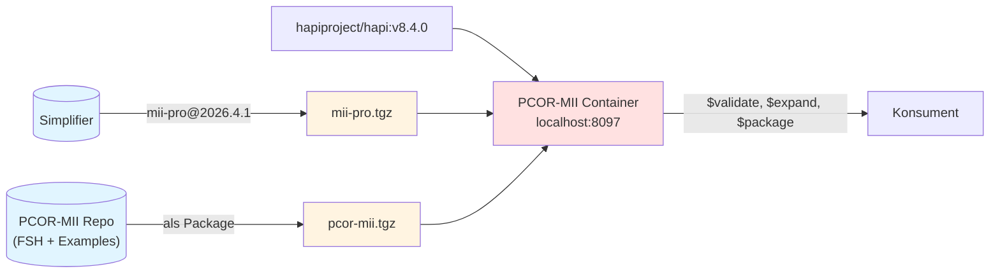
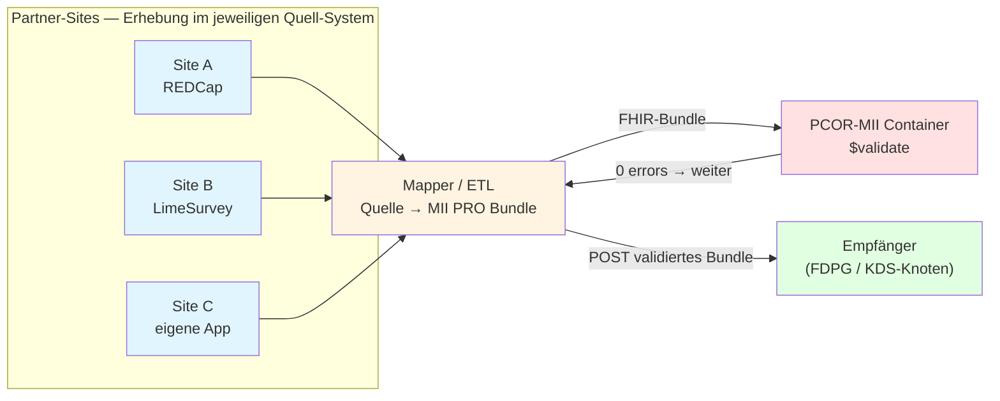

Diese Seite beschreibt, was ein FHIR-Server vorhalten muss, damit `QuestionnaireResponse`s aus PCOR-MII interpretierbar und validierbar sind — und welche Optionen es für die initiale Befüllung gibt.

## Container-Stack (im PCOR-MII Repo)

Im Verzeichnis `docker/` liegt eine Multi-Stage-Dockerfile, die HAPI FHIR mit MII PRO + PCOR-MII vorinstalliert baut. Bake-Time, kein Cold-Start.



Erlaubt: lokale Validierung, Form-Rendering (optional, z.B. via LHC-Forms), Pilot-Datenaustausch.

## Was muss auf einem Empfänger-Server liegen?

Eine `QuestionnaireResponse` ist ohne Kontext nicht interpretierbar. Der Server braucht **mindestens**:

- den **`Questionnaire`** (sonst sind `linkId`s sinnlos)
- die referenzierten **`ValueSet`s** (sonst keine Code-Validierung)
- die zugrundeliegenden **`CodeSystem`s** (LOINC) — entweder als Mirror oder via TerminologyServer
- das **`MII PR PRO QuestionnaireResponse`-Profil** (für Struktur-Validierung)

Für PROMIS-16 konkret: 1 Questionnaire + 3 ValueSets + LOINC-Konzepte + PRO-QR-Profil. Im PCOR-MII Container schon vorgeladen.

## Vier Optionen, den Empfänger zu befüllen

### A. Transaction-Bundle (funktioniert mit jedem Server)

```http
POST [base]/  Content-Type: application/fhir+json
{ "resourceType": "Bundle", "type": "transaction", "entry": [ ... PUT-Einträge pro Resource ... ] }
```

Volle Kontrolle, aber manuell zusammenstellen.

### B. Pre-built Container (für Pilot empfohlen)

Den PCOR-MII Container aus diesem Repo verwenden — Pakete sind bake-time eingebaut, kein Bootstrap nötig. `docker compose up` und der Server ist bestückt.

### C. `$package`-Operation (FHIR-Crmi, dynamisch)

Wenn der Producer-Server FHIR Crmi unterstützt, lässt sich das Transaction-Bundle aus A automatisch erzeugen lassen:

```http
GET [producer]/Questionnaire/mii-qst-pro-promis-16/$package
```

Antwort = transaction-fertiges Bundle mit Questionnaire + alle transitiv referenzierten ValueSets/CodeSystems/Profile, versioniert. Konsument PUTet das auf seinen Server.

ValueSets kommen im `compose`-Format (Definition), **nicht** als `expansion`. Für die PROMIS-VS reicht das, weil die Konzepte inline in `compose.include[].concept[]` mit DE-`designation` definiert sind. Falls man die Expansion explizit braucht: pro VS `GET .../$expand` aufrufen.

`$package` ist nicht in jedem FHIR-Server aktiv (HAPI braucht Clinical-Reasoning-Modul; Firely Server hat es nativ).

### D. NPM-Package via Server-IG-Loader

Manche Server (HAPI ab v6.x, Firely) können beim Boot direkt aus dem Package-Cache (`~/.fhir/packages`) oder von einer URL laden — genau das macht unser Container intern.

## PUT, POST, und Versions-Koexistenz

Auf Standard-FHIR-Servern (HAPI ohne Spezial-Konfiguration) gilt:

- `PUT Questionnaire/promis-29` **überschreibt** den existierenden Eintrag. `Questionnaire.version` wird dabei auch überschrieben — pro `id` koexistiert nur eine logische Version.
- Folge: eine ältere QR mit `questionnaire = "…|2026.3.0"` ist nach dem Overwrite nicht mehr sauber resolvbar (Server hat nur 2026.4.1 unter dieser `id`).
- `POST` (ohne `id`) erzeugt eine neue Resource — pro Re-Upload entstehen aber **Duplikate**, also keine Lösung für Idempotenz.

**Saubere Multi-Version-Patterns**:

| Pattern | Wie | Note |
|---------|------|------|
| Versions-Suffix in `id` | `Questionnaire/promis-29-v2026-3-0` neben `…-v2026-4-1` | universell, Clients müssen die Konvention kennen |
| HAPI Multi-Version-Mode | HAPI ab v6.x, Terminology-Service-Konfig | FHIR-nativer Canonical-Lookup mit `version` |
| Package-Registry-Resolution | Server löst Canonicals on-demand aus `packages.simplifier.net` | Trennt Daten von Definitionen, braucht Internet |

**Für den PCOR-MII Pilot**: eine einzige PRO-Version (`2026.4.1`) durchgehend, PUT mit fester `id`, Multi-Version-Patterns erst bei Bedarf einführen. `Questionnaire.version` in QR-Referenzen immer mitgeben (`…|2026.4.1`), damit ein späterer Multi-Version-Server sauber auflösen kann.

## Pilot-Datenfluss "50 First Patients"

Das Erfassungs-System kann außerhalb FHIR liegen (REDCap, LimeSurvey, eigene App, Papier+Eingabemaske) **oder** direkt in FHIR erfolgen (LHC-Forms gegen PCOR-MII Container). **FHIR ist primär die Ablage- und Austausch-Form** zwischen Erhebung und Empfänger:



**Pro Site**:
1. Daten aus dem Quell-System exportieren
2. Mapper erzeugt ein FHIR-Bundle (QR + ggf. Score-`Observation`s), konform zum [PRO-QR-Profil](https://medizininformatik-initiative.github.io/kerndatensatzmodul-proms/dev/)
3. `POST /$validate` gegen PCOR-MII Container — wenn 0 errors, das Bundle senden
4. `POST` an den Empfänger-Server

**Zentral**:
- Container in einer für die Sites erreichbaren Umgebung deployen (oder jede Site lokal — Container ist klein und für reine Validierung stateless)
- Empfänger-Server ist getrennt (eigene Auth, Persistenz, Audit)

**Direkt-in-FHIR-Erfassung** (LHC-Forms o.ä.) ist als Pfad gleichwertig: der Mapper-Schritt entfällt, das Bundle entsteht direkt im Server. Beide Wege treffen sich bei `$validate`.

## Empfehlung für PCOR-MII Pilot

1. **PCOR-MII Container** lokal deployen pro Site oder zentral als Shared-Validator.
2. **Eine PRO-Version** (`2026.4.1`) durchgehend, kein Multi-Version-Setup.
3. **Vor jedem Send**: `$validate` gegen den Container.
4. **`Questionnaire.version`** in QR-Referenzen immer mitführen (`…|2026.4.1`).
