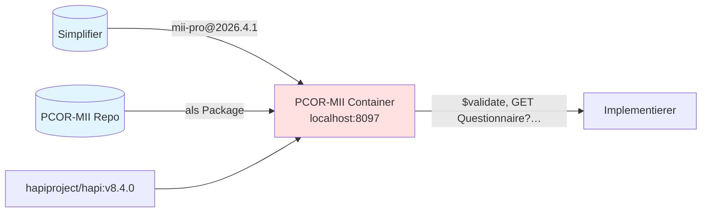
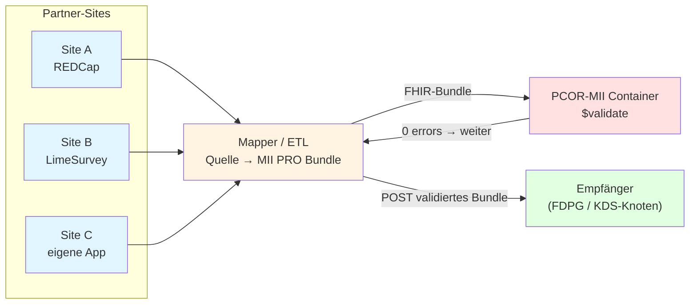

Diese Seite beschreibt, **wie Implementierer die PCOR-MII Datendefinitionen konsumieren können** — Questionnaire-Definitionen, ValueSets, das PRO-QR-Profil und Beispiele.

## Was du bekommst

| Kategorie | Resources |
|-----------|-----------|
| Profile (Struktur-Constraints) | `MII PR PRO QuestionnaireResponse`, `MII PR PRO Questionnaire` (aus dem MII PRO-Modul) |
| Questionnaire-Definitionen | PROMIS-29, PROMIS-16, PROMIS Cognitive Function SF 4a, DEM, PCOR Beispiel (PCOR-MII + MII PRO-Modul) |
| ValueSets | Frequency-/Intensity-/Physical-Function-Response-Scale + lokale PCOR-MII ValueSets |
| Beispiele | validierte `QuestionnaireResponse`s (siehe [Validierung](Validierung.html)) |

## Wege, das zu bekommen

### 1. PCOR-MII Container (für Mapper-Entwicklung, lokales Testen)

Vorgebauter HAPI FHIR Server mit MII PRO + PCOR-MII pre-loaded. Best für: Bundle gegen `$validate` prüfen, Definitionen ad-hoc per FHIR-API ziehen.



```bash
docker compose -f docker/docker-compose.yml up --build
curl http://localhost:8097/fhir/Questionnaire?_summary=true            # alle Definitionen
curl http://localhost:8097/fhir/Questionnaire?url=…/mii-qst-pro-promis-16   # gezielt
```

Details: [docker/README.md](https://github.com/BIH-CEI/PCOR-MII/tree/main/docker)

### 2. MII PRO Package via Simplifier (für Build-Pipelines)

Das MII PRO-Modul liegt als FHIR-NPM-Package auf Simplifier. Best für: Integration in SUSHI/IG Publisher/FHIR Validator-Builds.

```bash
fhir install de.medizininformatikinitiative.kerndatensatz.pros 2026.4.1
# entpackt nach ~/.fhir/packages/de.medizininformatikinitiative.kerndatensatz.pros#2026.4.1/
```

Beispiel `sushi-config.yaml`:
```yaml
dependencies:
  de.medizininformatikinitiative.kerndatensatz.pros: 2026.4.1
  hl7.fhir.uv.sdc: 3.0.0
```

PCOR-MII selbst ist (Stand 2026.06.) **nicht** als Package veröffentlicht — wer nur die PCOR-MII-Definitionen braucht, nimmt Weg 1 oder 3.

### 3. Direkter Repo-Zugriff (für Scripting, Doku-Tools)

Repo klonen, SUSHI laufen lassen, FHIR JSONs sind in `fsh-generated/resources/`:

```bash
git clone https://github.com/BIH-CEI/PCOR-MII
cd PCOR-MII && sushi .
ls fsh-generated/resources/
```

Best für: ad-hoc Lookup, Skripte (wie unser [extract-qst-translations](https://github.com/BIH-CEI/PCOR-MII/tree/main/scripts)), CI-Integrationen.

### 4. `$package`-Operation (für Bestückung eines fremden FHIR-Servers)

Wenn ein Producer-Server FHIR Crmi unterstützt:

```http
GET [producer]/Questionnaire/mii-qst-pro-promis-16/$package
```

liefert ein transaction-fertiges Bundle mit dem Questionnaire + allen referenzierten ValueSets/CodeSystems/Profilen, versioniert. Konsument PUTet das auf seinen eigenen Server.

ValueSets kommen im `compose`-Format. Für PROMIS reicht das, weil die Konzepte inline definiert sind. HAPI braucht für `$package` das Clinical-Reasoning-Modul (im PCOR-MII Container nicht out-of-the-box).

## Versions-Koexistenz auf Empfänger-Servern

Auf Standard-HAPI: `PUT Questionnaire/promis-29` mit neuer `Questionnaire.version` **überschreibt** den existierenden Eintrag. Eine ältere QR mit `…|2026.3.0`-Referenz ist danach nicht mehr sauber resolvbar — pro `id` koexistiert nur eine Version.

Für den PCOR-MII Pilot ist das egal: eine PRO-Version (2026.4.1) durchgehend. Bei späterer Migration: Versions-Suffix in der `id` (z.B. `promis-29-v2026-4-1`) oder HAPI mit Multi-Version-Mode. In QR-Referenzen die Version immer mitführen (`…|2026.4.1`).

## Pilot-Datenfluss "50 First Patients"

Das Erfassungs-System kann außerhalb FHIR liegen (REDCap, LimeSurvey, eigene App) **oder** direkt in FHIR (LHC-Forms o.ä.). FHIR ist primär die **Ablage- und Austausch-Form**:



Site exportiert aus Quell-System → Mapper baut FHIR-Bundle → gegen Container validieren → ans FDPG/KDS senden. Bei Direkt-in-FHIR-Erfassung entfällt der Mapper-Schritt; beide Pfade treffen sich bei `$validate`.
