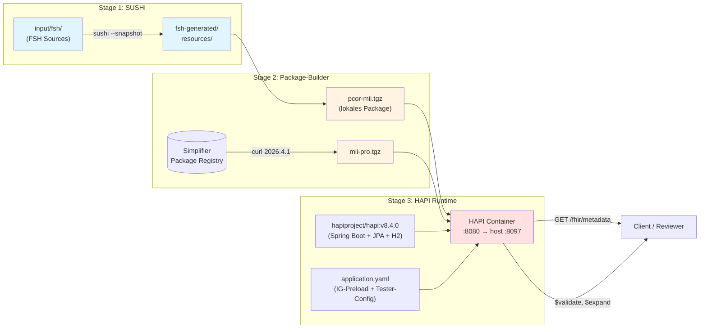
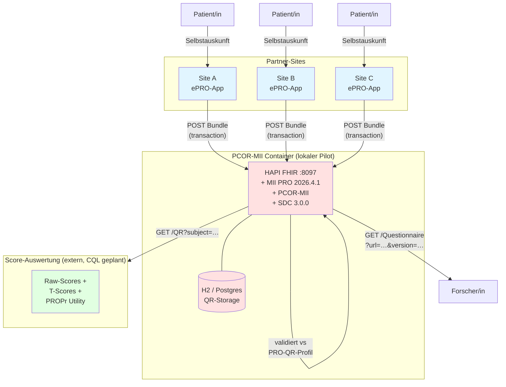

Diese Seite beschreibt, was ein FHIR-Server bereitstellen muss, damit `QuestionnaireResponse`s aus PCOR-MII *interpretierbar* und *validierbar* sind — und welche Optionen es für die initiale Befüllung des Servers gibt.

## Container-Build-Stack (im PCOR-MII Repo)

Im Verzeichnis `docker/` dieses Repos liegt eine Multi-Stage-Dockerfile, die einen kompletten HAPI FHIR Server mit MII PRO und PCOR-MII vorinstalliert baut. Build-Time-Bake → kein Cold-Start, kein Online-Download zur Laufzeit.



Erlaubt: lokale Validierung (siehe [Validierung](Validierung.html)), Form-Rendering via [LHC-Forms](https://lhcforms.nlm.nih.gov/), Pilot-Datenaustausch (siehe unten).

## Das Problem: ein QR alleine reicht nicht

Eine `QuestionnaireResponse` enthält:

- `questionnaire` → Canonical-URL auf den Fragebogen
- `item.linkId` → verweist auf das Item *im* Fragebogen
- `answer.valueCoding.code` → verweist auf ein Konzept *aus dem* `answerValueSet` oder `answerOption` des Items

**Ohne den Fragebogen selbst** weiß ein konsumierender Server/Client nicht, was die `linkId`s bedeuten, welcher Itemtext dahintersteht, oder welche `code`-Werte zulässig waren. Die QR ist im strengen Sinn **nicht interpretierbar**.

**Ohne die ValueSets/CodeSystems** kann der Server nicht prüfen, ob die gelieferten Codes gültig waren — Code-Bindungs-Validation schlägt fehl. Display-Anreicherungen (z.B. "LA6270-8 = Nie") sind ohne CodeSystem nicht möglich.

Konkret für PCOR-MII heißt das: ein FHIR-Server, der PROMIS-16-QRs entgegennimmt, muss **mindestens** diese Ressourcen vorhalten:

- `Questionnaire/mii-qst-pro-promis-16` (das Instrument)
- `ValueSet/mii-vs-pro-promis-frequency-response-scale`
- `ValueSet/mii-vs-pro-promis-intensity-response-scale`
- `ValueSet/mii-vs-pro-promis-physical-function-response-scale`
- die unter den ValueSets gebundenen LOINC-Konzepte (über einen Terminology-Server oder als CodeSystem-Mirror)
- `StructureDefinition/mii-pr-pro-questionnaire-response` (das PRO-QR-Profil)

## Optionen für die Server-Befüllung

### Option A: $package-Operation (FHIR-Native, empfohlen)

[Die FHIR-Packaging-Spec](https://hl7.org/fhir/uv/packaging/) definiert eine `$package`-Operation, mit der ein Server ein komplettes NPM-Package (z.B. `de.medizininformatikinitiative.kerndatensatz.pros#2026.4.1`) als Bundle entgegennimmt und alle Ressourcen registriert.

```http
POST [base]/$package
Content-Type: application/json

{
  "resourceType": "Parameters",
  "parameter": [
    { "name": "id", "valueString": "de.medizininformatikinitiative.kerndatensatz.pros" },
    { "name": "version", "valueString": "2026.4.1" }
  ]
}
```

Pro: deklarativ, vollständig, versioniert. Server-Implementierungen: HAPI (Operation `$import` mit Package-Manifest), Firely Server, einige Open-Source-FHIR-Implementierungen.

Con: nicht überall verfügbar. Manche Server unterstützen nur ad-hoc Transaction-Bundles.

### Option B: Pre-built HAPI Image mit gemounteten Inhalten

Ein vorgebautes [HAPI FHIR Starter](https://github.com/hapifhir/hapi-fhir-jpaserver-starter) Docker-Image, das beim Start die Packages aus dem `~/.fhir/packages`-Verzeichnis automatisch lädt:

```yaml
# docker-compose.yml
services:
  hapi:
    image: hapiproject/hapi:latest
    environment:
      HAPI_FHIR_IG_RUNTIME_UPLOAD_ENABLED: "true"
      HAPI_FHIR_IMPLEMENTATIONGUIDES_PCOR_MII_PACKAGE_URL: "https://bih-cei.github.io/PCOR-MII/package.tgz"
      HAPI_FHIR_IMPLEMENTATIONGUIDES_PCOR_MII_NAME: "pcor-mii"
      HAPI_FHIR_IMPLEMENTATIONGUIDES_MII_PRO_PACKAGE_URL: "https://packages.simplifier.net/de.medizininformatikinitiative.kerndatensatz.pros/2026.4.1"
      HAPI_FHIR_IMPLEMENTATIONGUIDES_MII_PRO_NAME: "mii-pro"
    ports:
      - "8080:8080"
```

Pro: schnell testbar, Standard-Setup. Geeignet für Entwicklungs- und Test-Umgebungen.

Con: nicht für produktiven Datenaustausch ohne weitere Härtung (Auth, Audit, Backup).

### Option C: Transaction-Bundle mit allen relevanten Resources

```http
POST [base]/
Content-Type: application/fhir+json

{
  "resourceType": "Bundle",
  "type": "transaction",
  "entry": [
    { "resource": { "resourceType": "Questionnaire", "id": "mii-qst-pro-promis-16", ... },
      "request": { "method": "PUT", "url": "Questionnaire/mii-qst-pro-promis-16" } },
    { "resource": { "resourceType": "ValueSet", "id": "mii-vs-pro-promis-frequency-response-scale", ... },
      "request": { "method": "PUT", "url": "ValueSet/mii-vs-pro-promis-frequency-response-scale" } },
    ...
  ]
}
```

Pro: funktioniert mit *jedem* FHIR-Server. Volle Kontrolle über jede einzelne Ressource.

Con: muss manuell zusammengestellt werden, keine automatische Versionsauflösung.

## PUT, POST, und das Problem der Versions-Koexistenz

Auf Standard-FHIR-Servern entsteht ein praktisches Problem, sobald mehrere Versionen desselben Fragebogens im Spiel sind:

### Was passiert mit `PUT Questionnaire/promis-29`?

Wenn du via Transaction-Bundle eine `Questionnaire/promis-29` mit `Questionnaire.version = "2026.4.1"` PUTtest und auf dem Server liegt schon dieselbe `id` mit `Questionnaire.version = "2026.3.0"`:

| Verhalten | Was passiert |
|-----------|--------------|
| `meta.versionId` (Server-seitiges Versionierungs-Feld) | wird hochgezählt: 5 → 6 (technische History) |
| `Questionnaire.version` (Business-Versionierungsfeld) | wird auf den neuen Wert `"2026.4.1"` **überschrieben** |
| Es existiert nur **eine** logische Ressource pro `id` | ja, immer |
| Mit `If-Match: W/"5"`-Header | 412 Precondition Failed, falls aktuelle `meta.versionId` ≠ 5 (= Optimistic Locking, **nichts** mit `Questionnaire.version` zu tun) |

### Konsequenz: Was ist mit bestehenden QRs, die auf `|2026.3.0` verweisen?

**Sie sind nach der Überschreibung nicht mehr sauber resolvbar.** Eine QR mit `questionnaire = "https://.../mii-qst-pro-promis-29|2026.3.0"` findet auf dem Server zwar dieselbe `id` — aber die liegt jetzt als `2026.4.1` vor. Der Renderer/Validator hat dann zwei Optionen:

1. **Strikt**: Lookup schlägt fehl (Version mismatch) → QR ist nicht renderbar.
2. **Lax**: Lookup ignoriert die Version → QR wird gegen die *aktuelle* Version interpretiert. Risiko: linkIds könnten sich geändert haben, codings könnten zu nicht mehr gültigen Antwortmöglichkeiten gehören.

Beides ist suboptimal. Die Lax-Variante ist besonders gefährlich für klinische Daten.

### POST statt PUT — löst das Problem?

`POST [base]/Questionnaire` (ohne `id` in der URL) lässt den Server eine **neue, eigene** `id` vergeben:

```http
POST [base]/Questionnaire
Content-Type: application/fhir+json
{ "resourceType": "Questionnaire", "url": "https://.../mii-qst-pro-promis-29", "version": "2026.4.1", ... }
```

Resultat: der Server speichert die neue Version unter `Questionnaire/auto-id-xyz`, parallel zur älteren `Questionnaire/auto-id-abc` mit version 2026.3.0.

**Aber**: bei jedem Re-Upload desselben Fragebogens entstehen **Duplikate**. Idempotenz geht verloren. Nicht ideal für Server-Pflege.

### Die richtige Achse: Multi-Version-Support

POST vs PUT ist nicht der entscheidende Hebel. Drei robuste Patterns:

| Pattern | Wie | Vorteil | Nachteil |
|---------|------|---------|----------|
| **A. Versions-Suffix in `id`** | `Questionnaire/promis-29-v2026-3-0`, `Questionnaire/promis-29-v2026-4-1` (PUT mit id) | funktioniert auf jedem FHIR-Server | Clients müssen die id-Konvention kennen; Canonical-Lookup über `?url=&version=` nicht out-of-the-box |
| **B. HAPI Multi-Version-Mode** | HAPI ab v6.x mit Terminology-Service-Konfiguration; mehrere `Questionnaire.version`-Werte koexistieren unter gleicher logischer `id` | sauberer FHIR-native Canonical-Lookup mit Version; semantisch korrekt | server-spezifisches Setup |
| **C. Package-Registry als Auflösungsquelle** | FHIR-Server lädt Canonicals on-demand aus `https://packages.simplifier.net/...` | klare Trennung: Definitionen im Package-Server, Daten im FHIR-Server | zusätzliche Abhängigkeit, Latenz, Offline-Setup schwieriger |

### Empfehlung für PCOR-MII

Für den Pilot:

1. **Eine einzige Version (`2026.4.1`)** in der gesamten Pilot-Phase. Keine Multi-Version-Komplexität.
2. **PUT mit fester `id`** in Transaction-Bundles zur initialen Server-Bestückung (idempotent, einfach).
3. **Bei späterer Versions-Migration**: Pattern A (Versions-Suffix) oder B (HAPI Multi-Version) — Entscheidung zum Zeitpunkt der ersten Major-Version-Migration treffen.

`Questionnaire.version` (das Business-Feld) sollte in der QR-Referenz **immer mitgeführt** werden: `questionnaire = "https://.../mii-qst-pro-promis-29|2026.4.1"`. Damit kann ein zukünftiger Multi-Version-Server die korrekte Auflösung sauber abbilden, auch wenn der heutige Standard-Server die Version ignoriert.

## Pilot-Datenfluss "50 First Patients"

Im Pilot tauschen mehrere Sites PROMIS-Daten gegen einen zentralen PCOR-MII-Server aus:



**Setup-Aufgaben pro Site**:
1. ePRO-App rendert PROMIS-16 oder PROMIS-29+Cognitive Function (Questionnaire-Definitionen aus PCOR-MII-Container über `GET /Questionnaire?url=…`)
2. Patient füllt aus → App erzeugt `QuestionnaireResponse` mit `meta.profile = mii-pr-pro-questionnaire-response|2026.4.1`
3. App POSTet als Transaction-Bundle an `/fhir`
4. PCOR-MII-Server validiert + speichert

**Setup-Aufgaben zentral**:
- PCOR-MII-Container in einer für Sites erreichbaren Umgebung deployen (lokales LAN / Reverse-Proxy / Cloud — je nach Konsortiums-Datenschutz-Konzept)
- Auth ergänzen vor produktivem Einsatz (HAPI-Defaults haben keine)
- Persistente DB statt H2

## Empfehlung für PCOR-MII Pilot

Für die [50-First-Patients Pilot-Kohorte](Implementation.html):

1. **Konsumierende Partner-Sites** mounten vorzugsweise ein **HAPI mit PRO + PCOR-MII Packages** via Option B (schnelles Setup, einheitlich).
2. **Datenversand** erfolgt über Transaction-Bundles mit `POST` (kein PUT für neue QRs) — auf die Server-vorhandenen `Questionnaire`-Ressourcen via Canonical-Referenz, keine Inline-Kopien.
3. **Versionierung**: das MII PRO-Modul kommt im Pilot in **einer einzigen Version** (`2026.4.1`) zum Einsatz. Multi-Version-Lookup wird nicht benötigt, solange der Pilot läuft.
4. **Validierung**: vor dem Versand lokal mit dem CLI-Validator (siehe [Validierung](Validierung.html)).
