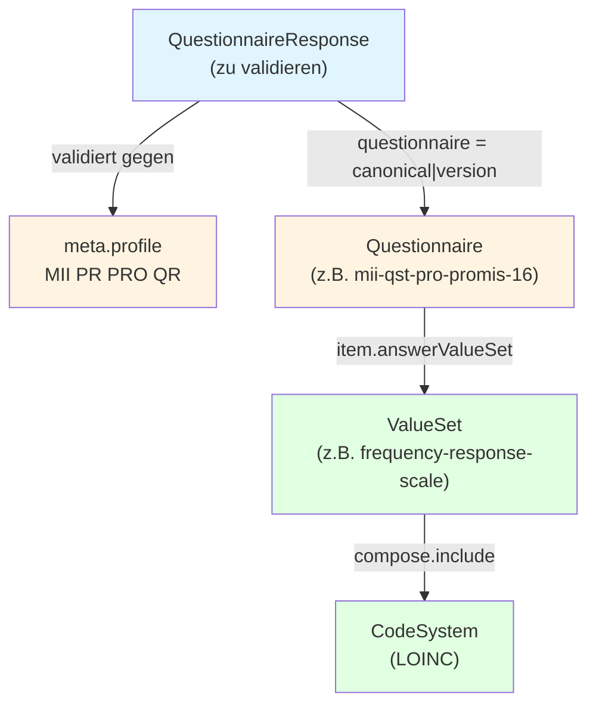

Diese Seite beantwortet die Frage: **wie stelle ich sicher, dass meine Implementierung valide gegenüber den PRO- und PCOR-MII-Datendefinitionen ist?**

## Worum geht's beim Validieren?

Eine `QuestionnaireResponse` (oder ein FHIR-Bundle das sie enthält) muss drei Dinge erfüllen, um "valide" zu sein:

1. **Strukturell** dem [`MII PR PRO QuestionnaireResponse`-Profil](https://medizininformatik-initiative.github.io/kerndatensatzmodul-proms/dev/) entsprechen (Datentypen, Pflichtfelder, Element-Constraints)
2. Die **`linkId`s** müssen mit der Item-Struktur des referenzierten Questionnaire übereinstimmen
3. Jede **codierte Antwort** muss aus dem `answerValueSet` (bzw. `answerOption`) des jeweiligen Items stammen



Damit das funktioniert, muss der Validator alle vier Resource-Ebenen kennen — sprich das **MII PRO-Modul Package (2026.4.1)** + SDC + LOINC. Bei den unten gezeigten Wegen passiert das automatisch via `-ig`-Parameter bzw. via Container-Preload.

## Drei Wege zum validierten Bundle

### A. Container-`$validate` (schnellste Schleife beim Mapper-Entwickeln)

[PCOR-MII Container](Bereitstellung.html) starten und das Bundle per HTTP gegen `$validate` werfen:

```bash
curl -X POST http://localhost:8097/fhir/QuestionnaireResponse/\$validate \
  -H "Content-Type: application/fhir+json" \
  -d @my-questionnaire-response.json
```

Antwort ist ein `OperationOutcome` mit `issue`-Liste, severity-getaggt. Praktisch für: iterative Mapper-Entwicklung in der Shell, schnelle Roundtrips ohne Java-Setup.

### B. HL7 Validator CLI (für CI-Pipelines)

Der offizielle Java-Validator. Empfohlen wenn dein Build-System keine HTTP-Endpoints aufrufen soll.

```bash
# Einmaliger Download
curl -L "https://github.com/hapifhir/org.hl7.fhir.core/releases/latest/download/validator_cli.jar" \
  -o ~/.fhir/validator_cli.jar

# Validieren
java -jar ~/.fhir/validator_cli.jar my-questionnaire-response.json \
  -version 4.0.1 \
  -ig de.medizininformatikinitiative.kerndatensatz.pros#2026.4.1 \
  -ig hl7.fhir.uv.sdc#3.0.0 \
  -profile https://www.medizininformatik-initiative.de/fhir/ext/modul-pro/StructureDefinition/mii-pr-pro-questionnaire-response
```

Best für: GitHub-Actions/GitLab-CI-Steps, Pre-Commit-Hooks, Mass-Validation großer Datensätze.

### C. IG Publisher Build (automatisch in deinem IG)

Wenn du einen eigenen Implementation Guide baust, der PCOR-MII konsumiert: deklariere die Resources mit `meta.profile` — IG Publisher validiert dann beim Build automatisch und stoppt bei Errors. Output in `output/qa.html` und `output/qa.json`.

## Was du in deiner Implementierung sicherstellst

Praktische Checkliste für Mapper/ePRO-App/Empfänger-Server-Bestückung:

- [ ] **`meta.profile`** auf der QR gesetzt — `mii-pr-pro-questionnaire-response|2026.4.1`
- [ ] **`questionnaire`-Referenz** mit Version — `…/mii-qst-pro-promis-16|2026.4.1`
- [ ] **`linkId`s** der Answer-Items matchen *exakt* die im Questionnaire definierten linkIds
- [ ] **Codierte Antworten** mit System + Code aus dem im Questionnaire definierten `answerValueSet` (für PROMIS-VS sind die LA-Codes inline in der VS dokumentiert — siehe [PROMIS-16](PROMIS-16.html) Item-Tabellen)
- [ ] **`status = completed`** (bzw. `in-progress`/`amended` je nach Lebenszyklus)
- [ ] **`subject`-Referenz** auf den Patienten
- [ ] **`authored`** Timestamp gesetzt
- [ ] **`text.div`** narrative mit `xml:lang`/`lang` wenn `Resource.language` gesetzt (siehe Best-Practice-Block unten)

## Severity-Interpretation

| Severity | Bedeutung | Acceptable? |
|----------|-----------|-------------|
| `error`    | FHIR-Konformanz verletzt | ❌ Muss behoben werden |
| `warning`  | FHIR-Best-Practice verletzt | ⚠️ Fall-by-Fall |
| `information` / `note` | Hinweis (z.B. Terminologie-Server konnte Code nicht auflösen) | ✓ meist OK |

### Häufige Warnings — wann ignorieren, wann nicht

| Warning | Was tun |
|---------|---------|
| `dom-6: A resource should have narrative for robust management` | `text.div`-Element ergänzen (FHIR Best Practice). Bei reinen Maschine-zu-Maschine-Bundles oft ignorierbar |
| `Die Ressource hat eine language, aber das XHTML hat kein lang Tag` | wenn `Resource.language` gesetzt, dann auch `xml:lang="de-DE" lang="de-DE"` am `<div>`-Element |
| `Wrong Display Name 'X' for http://loinc.org#LAxxx-y` | Display weicht von der LOINC-Bezeichnung ab (z.B. deutsche Übersetzung). Bewusst akzeptabel, bei strict-display-Servern via Setting deaktivierbar |
| `Canonical URL ... kann nicht aufgelöst werden` | Server hat den referenzierten Questionnaire nicht — entweder `-ig`-Parameter ergänzen oder Server-Bestückung prüfen (siehe [Bereitstellung](Bereitstellung.html)) |

## Validierte Beispiele als Referenz

Drei vollständige Beispiele in diesem IG, alle mit **0 errors, 0 warnings**:

- [`pcor-mii-exa-promis-16-response`](QuestionnaireResponse-pcor-mii-exa-promis-16-response.html)
- [`pcor-mii-exa-promis-cognitive-function-response`](QuestionnaireResponse-pcor-mii-exa-promis-cognitive-function-response.html)
- [`pcor-mii-exa-example-response`](QuestionnaireResponse-pcor-mii-exa-example-response.html) (für den Beispiel-Questionnaire)

Reproduzieren:

```bash
for f in input/examples/QuestionnaireResponse-*.json; do
  java -jar ~/.fhir/validator_cli.jar "$f" \
    -version 4.0.1 \
    -ig de.medizininformatikinitiative.kerndatensatz.pros#2026.4.1 \
    -ig hl7.fhir.uv.sdc#3.0.0 \
    -ig fsh-generated/resources \
    -profile https://www.medizininformatik-initiative.de/fhir/ext/modul-pro/StructureDefinition/mii-pr-pro-questionnaire-response
done
```

## Wozu Validierung in der Pipeline?

Validierung prüft strukturelle und Code-Bindungs-Konformanz, **nicht** klinische/inhaltliche Plausibilität. Sie schützt aber sehr zuverlässig vor den häufigsten Mapping-Fehlern: falsche LA-Codes (z.B. Frequency- vs Intensity-Skala verwechselt), fehlende Pflicht-Items, Versions-Mismatch zwischen `questionnaire`-Referenz und Server-Stand.

Für den [50-First-Patients Pilot](Implementation.html): **jeder Sender validiert lokal bevor er sendet**, jeder Empfänger validiert nochmal beim Eingang. Das fängt 95% der Drift-Probleme bei wenig Aufwand.
