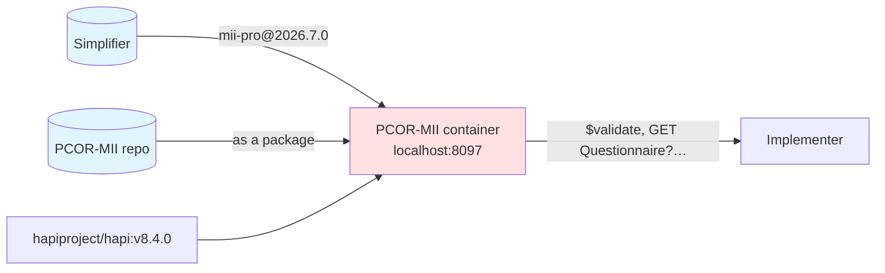
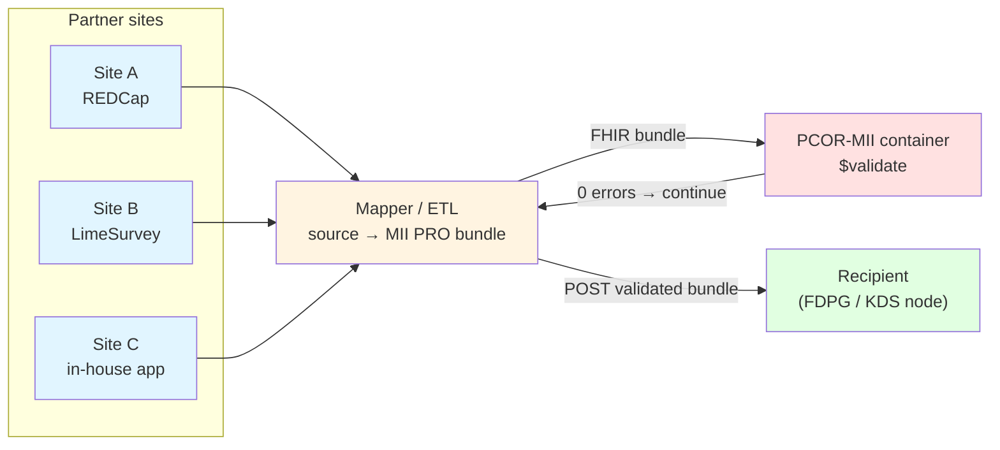

This page describes **how implementers can consume the PCOR-MII data definitions** — questionnaire definitions, ValueSets, the PRO QuestionnaireResponse profile and the examples.

## What you get

| Category | Resources |
|----------|-----------|
| Profiles (structural constraints) | `MII PR PRO QuestionnaireResponse`, `MII PR PRO Questionnaire` (from the MII PRO module) |
| Questionnaire definitions | PROMIS-29, PROMIS-16, PROMIS Cognitive Function SF 4a, DEM, PCOR example (PCOR-MII plus the MII PRO module) |
| ValueSets | frequency, intensity and physical-function response scales plus the local PCOR-MII ValueSets |
| Examples | validated `QuestionnaireResponse`s (see [Validation](Validierung.html)) |

## Ways to get it

### 1. PCOR-MII container (for mapper development and local testing)

A prebuilt HAPI FHIR server with MII PRO and PCOR-MII preloaded. Best for checking a bundle against `$validate` and pulling definitions ad hoc over the FHIR API.



```bash
docker compose -f docker/docker-compose.yml up --build
curl http://localhost:8097/fhir/Questionnaire?_summary=true            # all definitions
curl http://localhost:8097/fhir/Questionnaire?url=…/mii-qst-pro-promis-16   # one specific
```

Details: [docker/README.md](https://github.com/BIH-CEI/PCOR-MII/tree/main/docker)

### 2. MII PRO package via Simplifier (for build pipelines)

The MII PRO module is published as a FHIR NPM package on Simplifier. Best for integration into SUSHI, IG Publisher and FHIR validator builds.

```bash
fhir install de.medizininformatikinitiative.kerndatensatz.pros 2026.7.0
# unpacks into ~/.fhir/packages/de.medizininformatikinitiative.kerndatensatz.pros#2026.7.0/
```

Example `sushi-config.yaml`:
```yaml
dependencies:
  de.medizininformatikinitiative.kerndatensatz.pros: 2026.7.0
  hl7.fhir.uv.sdc: 3.0.0
```

PCOR-MII itself is **not** published as a package — anyone who only needs the PCOR-MII definitions should take route 1 or 3.

### 3. Direct repository access (for scripting and documentation tools)

Clone the repository, run SUSHI, and the FHIR JSON files are in `fsh-generated/resources/`:

```bash
git clone https://github.com/BIH-CEI/PCOR-MII
cd PCOR-MII && sushi .
ls fsh-generated/resources/
```

Best for ad-hoc lookups, scripts (such as our [extract-qst-translations](https://github.com/BIH-CEI/PCOR-MII/tree/main/scripts)) and CI integrations.

### 4. The `$package` operation (for populating someone else's FHIR server)

If a producing server supports FHIR CRMI:

```
GET [producer]/Questionnaire/mii-qst-pro-promis-16/$package
```

returns a transaction-ready bundle with the questionnaire and every referenced ValueSet, CodeSystem and profile, all versioned. The consumer PUTs that onto its own server.

ValueSets come in `compose` form. For PROMIS that is sufficient because the concepts are defined inline. For `$package`, HAPI needs the clinical-reasoning module, which is not enabled out of the box in the PCOR-MII container.

## Version coexistence on recipient servers

On a stock HAPI server, `PUT Questionnaire/promis-29` with a new `Questionnaire.version` **overwrites** the existing entry. An older response referencing `…|2026.3.0` can then no longer be resolved cleanly — only one version coexists per `id`.

For the PCOR-MII pilot this does not matter: one PRO version (2026.7.0) throughout. For a later migration, either put a version suffix in the `id` (for example `promis-29-v2026-4-1`) or run HAPI in multi-version mode. In responses, always carry the version in the reference (`…|2026.7.0`).

This is also why every PCOR-MII response pins its questionnaire version: `QuestionnaireResponse.questionnaire` is the only place where the wording actually shown to the respondent is recorded.

## Pilot data flow, "50 First Patients"

The capture system may sit outside FHIR (REDCap, LimeSurvey, an in-house app) **or** run directly in FHIR (LHC-Forms or similar). FHIR is primarily the **storage and exchange form**:



The site exports from its source system, the mapper builds a FHIR bundle, that bundle is validated against the container, and the result is sent to the FDPG or KDS node. Where capture happens directly in FHIR the mapper step falls away; both paths meet at `$validate`.

One step deserves attention when the source is a single large form rather than one form per instrument: the mapper has to **split** it into one `QuestionnaireResponse` per instrument. Each PCOR-MII item carries its dictionary variable in `Questionnaire.item.code`, so that split is a lookup rather than a hand-maintained table — see [ADR-011](Designentscheidungen.html).
